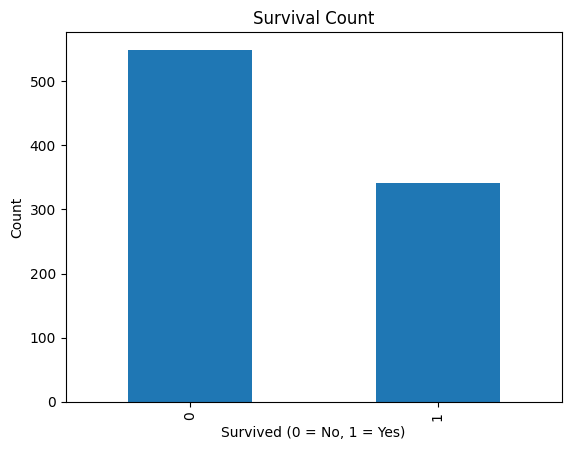
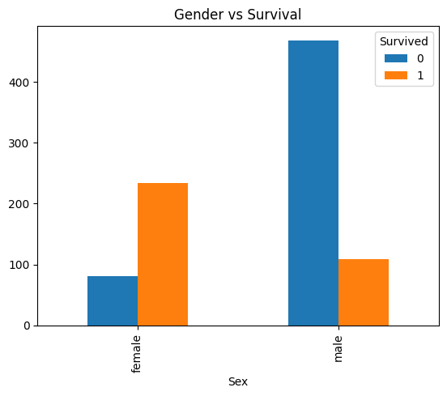
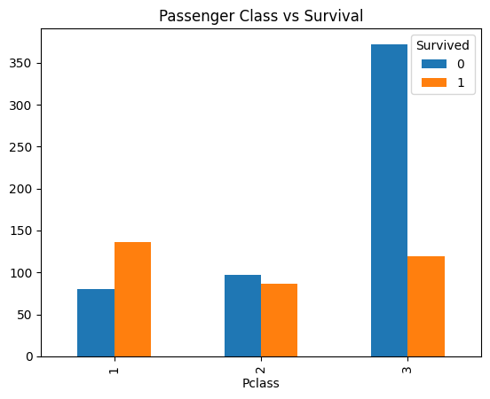
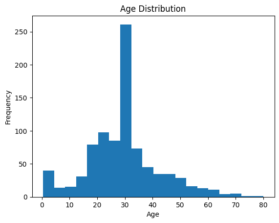
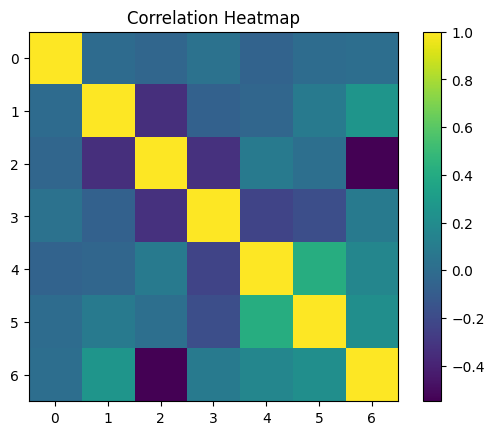

# 🚢 Titanic Data Analysis

## 📌 Project Overview

This project performs **Exploratory Data Analysis (EDA)** on the famous Titanic dataset using **Python** and **Jupyter Notebook**.

The primary objective is to analyze passenger information and uncover patterns that influenced survival during the Titanic disaster.

Using data visualization and statistical analysis, this project explores the relationship between survival and features such as gender, age, passenger class, fare, and family size.

---

## 🎯 Objectives

- Perform data cleaning and preprocessing
- Handle missing values effectively
- Explore passenger survival trends
- Visualize important patterns using charts and graphs
- Understand how passenger features impacted survival probability

---

## 📊 Analysis Performed

### ✔ Survival Count Analysis
Analyzed the distribution of survivors and non-survivors.

### ✔ Gender vs Survival
Compared survival rates between male and female passengers.

### ✔ Passenger Class vs Survival
Studied how ticket class affected survival chances.

### ✔ Age Distribution Analysis
Visualized the age distribution of passengers.

### ✔ Correlation Heatmap
Examined relationships between numerical features.

---

## 🛠️ Technologies Used

| Technology | Purpose |
|---|---|
| Python | Data Analysis |
| Pandas | Data Manipulation |
| NumPy | Numerical Operations |
| Matplotlib | Data Visualization |
| Seaborn | Statistical Visualization |
| Jupyter Notebook | Analysis Workflow |

---

## 📁 Project Structure

```text
titanic-eda-analysis/
│
├── images/
│   ├── age_distribution.png
│   ├── correlation_heatmap.png
│   ├── gender_vs_survival.png
│   ├── passenger_class_vs_survival.png
│   └── survival_count.png
│
├── .gitignore
├── requirements.txt
├── titanic.csv
├── titanic_eda_analysis.ipynb
└── README.md
```

---

## 🚀 How to Run the Project

### 1️⃣ Clone the Repository

```bash
git clone https://github.com/kunaltopare01/titanic-data-analysis.git
```

### 2️⃣ Navigate to the Project Folder

```bash
cd titanic-data-analysis
```

### 3️⃣ Install Required Libraries

```bash
pip install -r requirements.txt
```

### 4️⃣ Launch Jupyter Notebook

```bash
jupyter notebook
```

---

## 📈 Key Insights

- Female passengers had significantly higher survival rates than male passengers
- First-class passengers had better chances of survival
- Most passengers were between the age group of 20–40
- Passenger class, age, and gender strongly influenced survival probability
- The dataset contains missing values that required preprocessing and cleaning

---

## 🖼️ Visualizations

### 📌 Survival Count


---

### 📌 Gender vs Survival


---

### 📌 Passenger Class vs Survival


---

### 📌 Age Distribution


---

### 📌 Correlation Heatmap


---

## 📚 Dataset Information

- **Dataset:** Titanic Dataset
- **Source:** Kaggle
- **Purpose:** Educational & Learning Project

---

## 🔮 Future Improvements

- Add Machine Learning models for survival prediction
- Perform advanced feature engineering
- Build an interactive dashboard
- Deploy the project using Streamlit

---

## 👩‍💻 Author

### Kunal Topare

Aspiring Data Analyst & Python Enthusiast

### Skills
Python | Pandas | Data Analysis | Data Visualization | EDA
